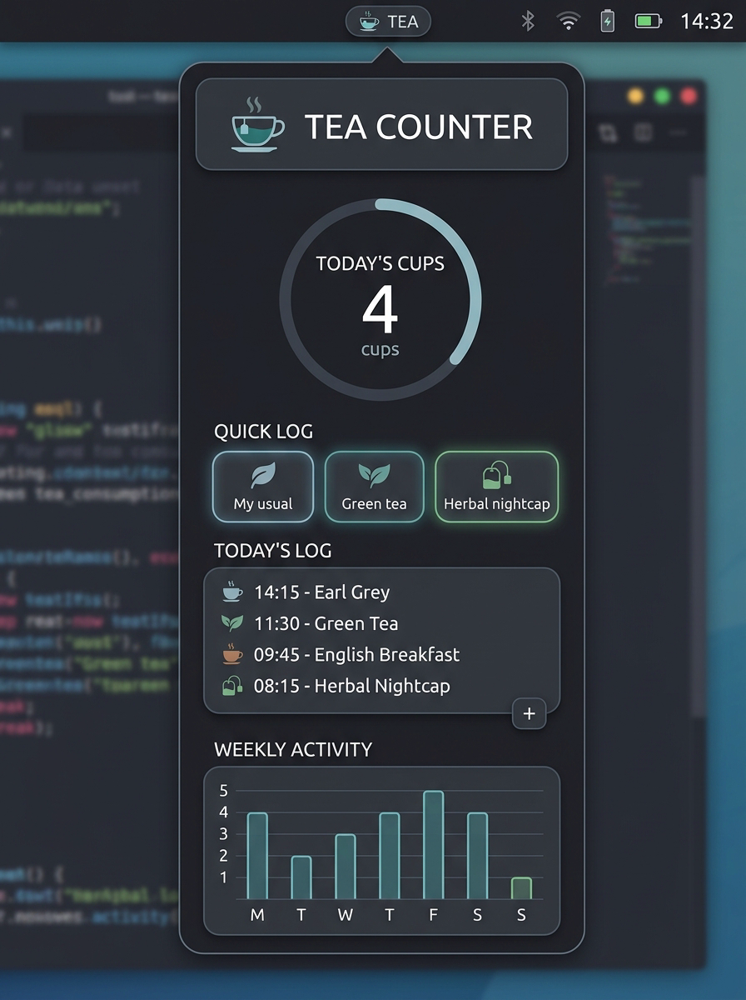

# Tea Counter

An Omarchy bar widget that counts cups of tea and the caffeine that came
with them, with a one-tap dropdown logger and week / month / year history.

The bar label is today's caffeine load. Click it for the dropdown.



No account, API key, network request, daemon, or install hook. Everything is
local, and the only file it writes outside its own directory is its log.

## Requirements and dependencies

- **Omarchy Quattro** with the Quickshell-based shell (`omarchy-shell`).
- **A Nerd Font** for the tea (`󰶞`), moon, and control glyphs — Omarchy's default
  `JetBrainsMono Nerd Font` already covers them.
- **Python 3.9+**, only for the optional `bin/omarchy-tea` CLI. The bar
  widget itself is pure QML and does not invoke Python.
- **`node`**, only to run `tests/test_parity.py`. Not needed to use the plugin.

There are no bundled binaries, no third-party libraries, no package installs,
and no `sudo` or `pkexec` anywhere in the plugin.

## Install and Enable

To enable the plugin on your Omarchy bar:

```bash
omarchy plugin enable michael.tea
```

It defaults to the right section of the bar. To move it:

```bash
omarchy bar move michael.tea --section center
```

Optionally put the CLI on your `PATH`:

```bash
mkdir -p ~/.local/bin
ln -sf ~/.config/omarchy/plugins/michael.tea/bin/omarchy-tea ~/.local/bin/
```

## Remove

```bash
omarchy plugin disable michael.tea
# or completely remove:
omarchy plugin remove michael.tea
```

That disables or removes the plugin and its bar entry. Your log is left alone so a
reinstall picks up where you left off — delete it yourself if you want it gone:

```bash
rm ~/.local/state/omarchy/tea.json
rm -f ~/.local/bin/omarchy-tea   # only if you created the symlink above
```

## Logging a cup

The dropdown leads with your presets — one click each. `Custom…` opens the
full picker when the cup doesn't match a preset:

| Axis  | Options                                       |
|-------|-----------------------------------------------|
| Type  | Black · Green · Herbal · Decaf                |
| Size  | ¼ · ½ · ¾ · 1 · 1½ cup                        |
| Style | Plain · Sweet · Milk · Both                   |
| When  | any past day, any time (backfill)             |

Three presets ship by default:
- **My usual** (black tea, 1 cup, plain — 47 mg)
- **Green tea** (green tea, 1 cup, plain — 28 mg)
- **Herbal nightcap** (herbal tea, 1 cup, plain — 0 mg)

Add, edit, and delete your own from `Presets` in the dropdown.

## The caffeine model

One full cup of black tea is **47 mg** — standard 8oz brewed black tea.
Everything scales off that single number, which you can retune in widget settings:

```
mg = baseMg × type factor × size fraction

black  = ×1.0     ¼ cup  = ×0.25
green  = ×0.6     ½ cup  = ×0.5
herbal = ×0.0     1 cup  = ×1.0
decaf  = ×0.04    1½ cup = ×1.5
```

So green tea in a standard cup is 28 mg, half a cup of black tea is 24 mg, and herbal tea is 0 mg.

Style (plain / sweet / milk / both) is recorded for breakdowns but does not
affect the caffeine math.

## The day boundary

A day rolls over at **4am**, not midnight, so a 2am cup counts toward the night
before rather than opening a day you haven't woken up into. Change it with the
`rolloverHour` setting; `0` gives you strict midnight.

## History

The dropdown shows a Mon–Sun bar strip for the current week (hover a bar for
that day's numbers) plus running week, month, and year totals and a daily
average over the days you actually logged. Bars are scaled to the week's own
peak, so a light week still has a readable shape.

## Mouse and keyboard

| Input                | Action                                |
|----------------------|---------------------------------------|
| Left click bar       | Open/close the dropdown               |
| Right click bar      | Log the first preset immediately      |
| Middle click bar     | Undo the last cup                     |
| `1`–`9`              | Log preset 1–9                        |
| `c`                  | Custom cup                            |
| `p`                  | Presets                               |
| `n` (on presets)     | New preset                            |
| `u`                  | Undo last cup                         |
| `e`                  | Export CSV                            |
| `Esc`                | Back, then close                      |

## Command line

`bin/omarchy-tea` reads and writes the same log, so a cup logged in a
terminal appears in the bar within a second.

```bash
omarchy-tea log                      # log the first preset
omarchy-tea log "Herbal nightcap"    # by name, or by 1-based number
omarchy-tea log --type green --size 0.5 --style plain
omarchy-tea log --at "2026-08-25 15:30" --size 0.5
omarchy-tea today                    # today's cups, listed
omarchy-tea stats                    # week / month / year / all time
omarchy-tea undo                     # remove the most recent cup
omarchy-tea presets                  # list presets
omarchy-tea export [path]            # CSV, defaults to ~/tea-history.csv
```

The shell also exposes IPC:

```bash
omarchy-shell tea today
omarchy-shell tea log
omarchy-shell tea undo
omarchy-shell tea csv
omarchy-shell tea toggle
```

## Settings

Configured per-widget in `~/.config/omarchy/shell.json` (or through the shell's
widget settings UI):

| Key            | Default          | Meaning                                            |
|----------------|------------------|----------------------------------------------------|
| `barDisplay`   | `Caffeine (mg)`  | `Caffeine (mg)` · `Cups` · `Cups and mg` · `Icon only` |
| `rolloverHour` | `4`              | Hour a new day starts (0–12)                       |
| `baseMg`       | `47`             | Caffeine in one full cup of black tea (mg)         |

## Data

Everything lives in one file: `~/.local/state/omarchy/tea.json` — entries
and presets, written atomically. Back it up, sync it, or edit it by hand; the
widget watches the file and repaints on change.

## Theming

No colors are hard-coded. Foreground, accent, fonts, spacing, corner radius,
and border treatment all come from the shell's theme singletons, so
`omarchy theme set <name>` restyles the widget and dropdown with it.

## Credits and Acknowledgements

This plugin is directly based on and adapted from [**omarchy-coffee-counter**](https://github.com/theNetworkChuck/omarchy-coffee-counter.git) by **Chuck Keith ([NetworkChuck](https://github.com/theNetworkChuck))**.

Huge thanks to NetworkChuck for the original architecture, QML widget layout, caffeine calculation model, and CLI companion design!
